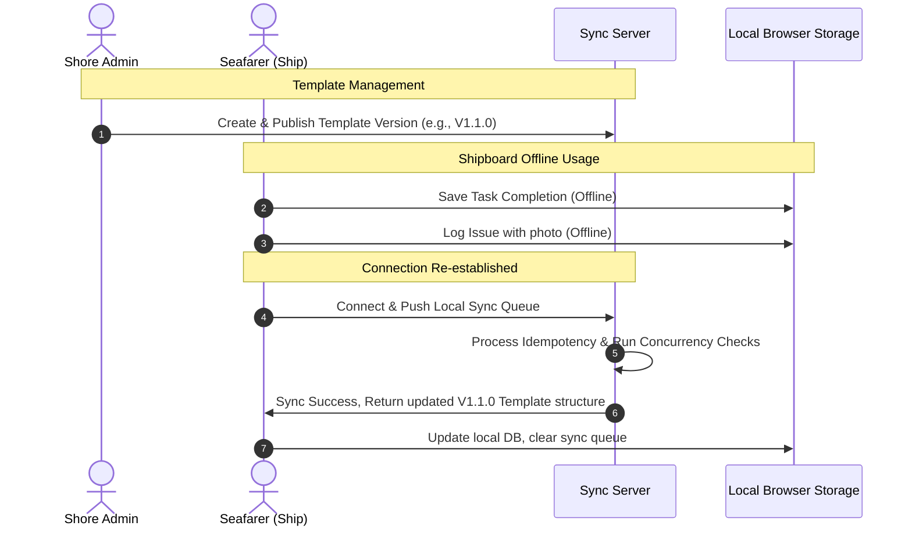

# Project Overview — Maritime Tasks Monitoring System

Welcome to the Maritime Tasks Monitoring System. This document provides a high-level product and business-centric overview of the system for product managers, designers, frontend developers, and future AI agents.

---

## 1. What is the System?

The Maritime Tasks Monitoring System is a compliance, operational safety, and task-logging platform designed specifically for commercial shipboard operations. It functions as an offline-first digital operational logbook and checklist manager, tailored in its initial version (V1) for individual seafarers (primarily Second Officers).

The system ensures that critical maritime tasks (e.g., safety checks, navigation instrument calibration, GMDSS testing, and inspections) are executed on schedule, recorded transparently, and logged securely, even when operating in remote locations with intermittent or zero internet connectivity.

---

## 2. Who Uses It?

1. **Seafarers (Users / Second Officers)**: The primary operators onboard the vessel. They customized their daily checklists, log task executions, raise vessel issues with photo evidence, and check compliance metrics.
2. **Vessel Managers / Port Captains (Admins)**: Shore-side personnel who audit vessel performance, review history log entries, analyze reported issues, and inspect export reports.
3. **Marine Superintendents / Fleet Managers (Super Admins)**: Shore-side directors who define fleet-wide compliance templates, version checklists, assign templates to ranks/vessel types, control user roles, and trigger template upgrades across the fleet.

---

## 3. What Problem Does It Solve?

- **Paper Logbook Inefficiencies**: Replaces manual paper checklists with digital entries, preventing loss of historical records and enabling searchability.
- **Intermittent Connectivity (Offline-First)**: Ships operate at sea with limited or no satellite connection. The system allows seafarers to work entirely offline, caching operations locally and auto-synchronizing them once a network connection is established.
- **Audit and Regulatory Compliance**: Generates tamper-proof, structured logs for port state control inspectors and internal vetting audits.
- **Standardized Fleet Checklists**: Fleet managers can update standard procedures and push version-controlled templates dynamically to active vessels.

---

## 4. Concepts and Terminology

### Conceptual Templates
A template represents the master definition of task categories, specific checklist items, and their default execution properties for a given maritime rank (e.g., Second Officer) and vessel type (e.g., LPG Tanker). 

### Template Versions
All templates are version-controlled using semantic numbering (e.g., `1.0.0`, `1.1.0`).
- **DRAFT**: The version is currently being edited by a Super Admin. Category ordering, task definitions, and assignment configurations can only be modified in this state.
- **UNDER_REVIEW**: The draft version has been frozen and is undergoing internal vetting. It cannot be edited further unless rolled back to draft.
- **PUBLISHED**: The version is active and ready to be propagated. It is read-only and serves as the source of truth for synchronization.

### Template Synchronization (The Update Engine)
When a template is updated and published, active vessels carrying previous versions must be synchronized. The system supports two update modes:
- **SAFE Mode**: Automatically merges new categories and tasks. If a task has been modified or conflicts exist, they are preserved and flagged for user review without destroying local logs.
- **FORCE Mode**: Overwrites the vessel's active checklist structure with the new published template version, resetting active structures but archiving previous task logs.

### The Daily Task Cycle
Checklists run on specific operational cycles:
- **Daily Tasks**: Must be completed within the calendar day.
- **Weekly Tasks**: Renew once a week, specifically on **Thursdays at 00:00 UTC** (a standard maritime transition day).
- **Monthly Tasks**: Renew on the first calendar day of each month.
- **Signing-On Tasks**: A dedicated onboarding checklist completed within the seafarer's first 14 days of boarding a new vessel.

### Task Execution Statuses
- **Pending**: Task has not been started.
- **Completed**: Task successfully executed, logged with a timestamp and optional notes.
- **Postponed**: Task was delayed due to weather, port operations, or technical issues. Postponing requires the user to submit an operational justification note.

---

## 5. Complete User Journeys

### User Journey A: Seafarer Onboard Usage
1. **Initial Sign-On**: The Seafarer logs into the web application, creates their profile, and registers the active vessel (specifying name, type, and GRT).
2. **Onboarding familiarization**: For the first 14 days, the seafarer completes the specialized "Signing-On" checklist.
3. **Daily Routine**: 
   - Every morning, the seafarer opens the checklist screen. They see a list of categories (e.g., "Bridge Inspection", "GMDSS Tests").
   - They execute the check, click **Complete**, and input any measurements.
   - If a radar unit is undergoing maintenance, they select **Postpone** and type a justification (e.g., *"Technician onboard resolving magnetron failure"*).
4. **Logging an Issue**: During bridge inspection, the user detects a safety harness tear. They tap "Report Issue", take a photo, write a description, select severity, and link it to the task.
5. **End of Voyage**: Before signing off the vessel, the seafarer exports their complete operational history as a PDF report for handover.

### User Journey B: Shore-Side Fleet Administrator
1. **Login & Role Check**: The Administrator logs in and is navigated to the Admin Dashboard.
2. **Create/Update Template**: The Administrator creates a new "Second Officer LPG Template", adds task definitions, and designates it to "LPG" vessels.
3. **Review Version**: The Admin advances the template version from `DRAFT` to `UNDER_REVIEW`.
4. **Publish version**: The Super Admin reviews the changes and marks the version as `PUBLISHED`.
5. **Sync Fleet**: The Admin goes to the Template Synchronization tab, chooses `SAFE` mode, and runs the sync job. All Second Officers on LPG vessels instantly receive the updated categories and task definitions when their app connects to the internet.

---

## 6. System Workflows

---

## 7. Role Specifications

| Role | Target | Access Level | Responsibilities |
| :--- | :--- | :--- | :--- |
| **User (Seafarer)** | Shipboard | User App | Manages vessels, completes checklists, logs issues, views history, exports compliance documents. |
| **Admin** | Shore-side | Admin App | Audits user lists, resets accounts, reviews historical logs, drafts templates, monitors sync jobs. |
| **Super Admin** | Shore-side | Admin App | Full privileges. Demotes/promotes Admins, publishes template versions, executes template synchronization updates, audits system metrics. |
